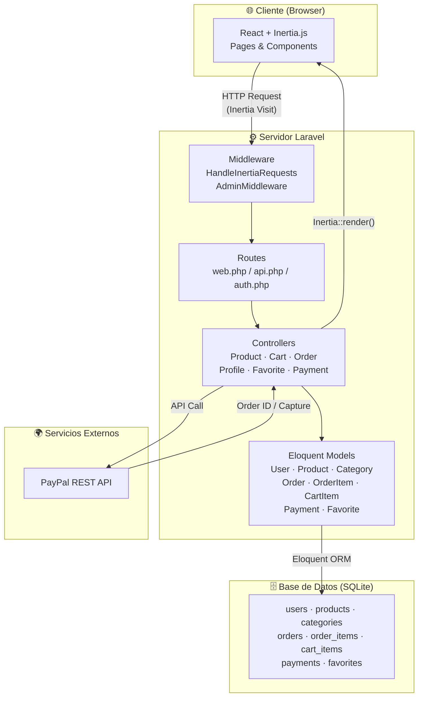
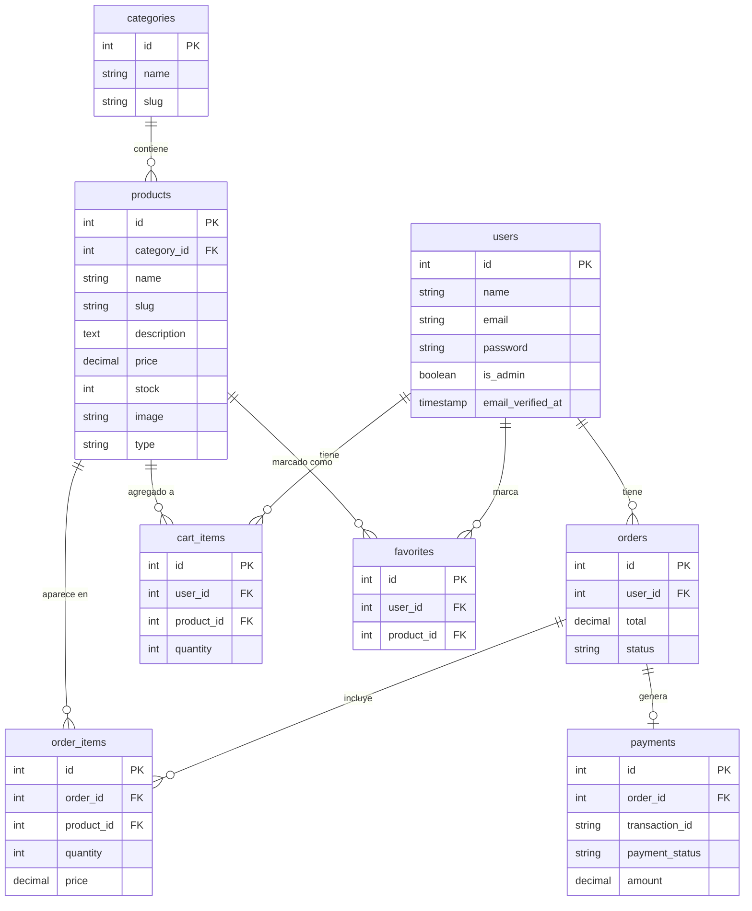
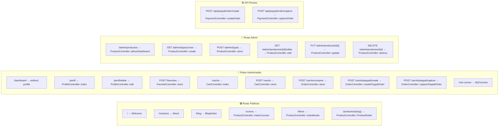
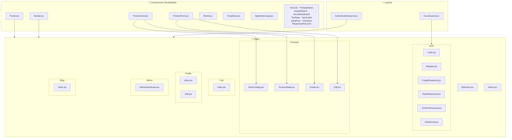
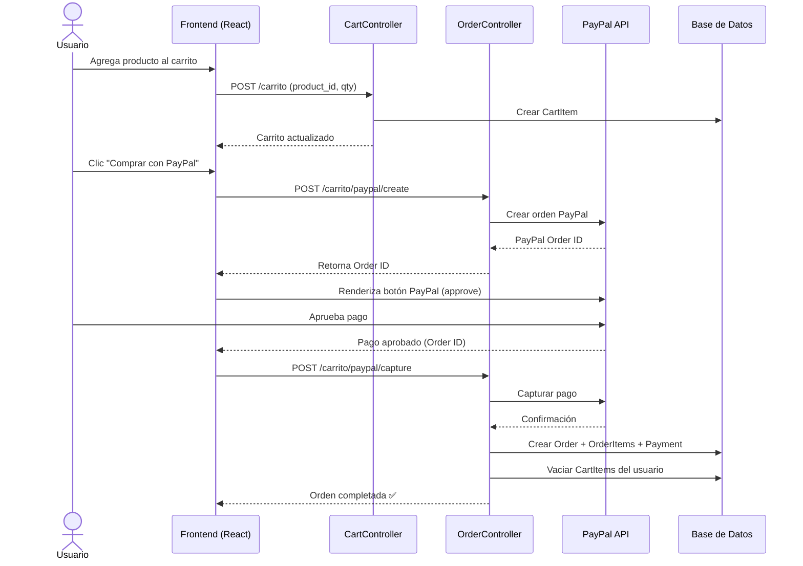
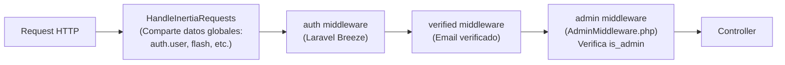

# 🏗️ Diagrama de Arquitectura — Proyecto Academia

> Plataforma de e-commerce académico construida con **Laravel 12 + Inertia.js + React (JSX)** y pagos vía **PayPal**.

---

## 1. Stack Tecnológico

| Capa | Tecnología |
|---|---|
| **Backend** | Laravel (PHP) |
| **Frontend** | React (JSX) vía Inertia.js |
| **Estilos** | Tailwind CSS |
| **Base de Datos** | SQLite |
| **Bundler** | Vite |
| **Pagos** | PayPal REST API |
| **Autenticación** | Laravel Breeze + Sanctum |

---

## 2. Arquitectura General (Flujo de Datos)



---

## 3. Modelo Entidad-Relación (Base de Datos)



---

## 4. Mapa de Rutas y Controladores



---

## 5. Estructura del Frontend (React + Inertia)



---

## 6. Flujo de Compra (Carrito → PayPal → Orden)



---

## 7. Middleware y Seguridad



---

## 8. Estructura de Archivos (Resumen)

```
Academia/
├── app/
│   ├── Http/
│   │   ├── Controllers/
│   │   │   ├── Auth/              ← Breeze auth controllers
│   │   │   ├── CartController      ← CRUD carrito
│   │   │   ├── FavoriteController  ← Marcar favoritos
│   │   │   ├── OrderController     ← Crear órdenes + PayPal
│   │   │   ├── PaymentController   ← API PayPal (create/capture)
│   │   │   ├── ProductController   ← Catálogo + CRUD admin
│   │   │   └── ProfileController   ← Perfil de usuario
│   │   ├── Middleware/
│   │   │   ├── AdminMiddleware     ← Verifica is_admin
│   │   │   └── HandleInertiaRequests ← Datos compartidos
│   │   └── Requests/              ← Form Requests
│   └── Models/
│       ├── User                   ← hasMany: orders, cartItems
│       ├── Product                ← belongsTo: category
│       ├── Category               ← hasMany: products
│       ├── Order                  ← belongsTo: user, hasMany: orderItems
│       ├── OrderItem              ← belongsTo: order, product
│       ├── CartItem               ← belongsTo: user, product
│       ├── Payment                ← belongsTo: order
│       └── Favorite               ← user_id, product_id
├── resources/js/
│   ├── Components/                ← 16 componentes reutilizables
│   ├── Layouts/                   ← Authenticated + Guest
│   └── Pages/
│       ├── Welcome, About         ← Páginas públicas
│       ├── Auth/                  ← Login, Register, etc.
│       ├── Products/              ← Catálogo, Detalle, CRUD
│       ├── Cart/                  ← Carrito de compras
│       ├── Profile/               ← Perfil del usuario
│       ├── Admin/                 ← Dashboard administrador
│       └── Blog/                  ← Blog (placeholder)
├── routes/
│   ├── web.php                    ← Rutas principales
│   ├── api.php                    ← API PayPal
│   └── auth.php                   ← Rutas Breeze
└── database/
    ├── migrations/                ← 12 migraciones
    └── database.sqlite            ← BD SQLite
```

---

> [!TIP]
> El proyecto sigue el patrón **Monolito Moderno**: Laravel maneja todo el backend (rutas, controladores, modelos, auth) y sirve las vistas React vía **Inertia.js**, eliminando la necesidad de una API REST separada para el frontend. Solo PayPal usa rutas API dedicadas.
